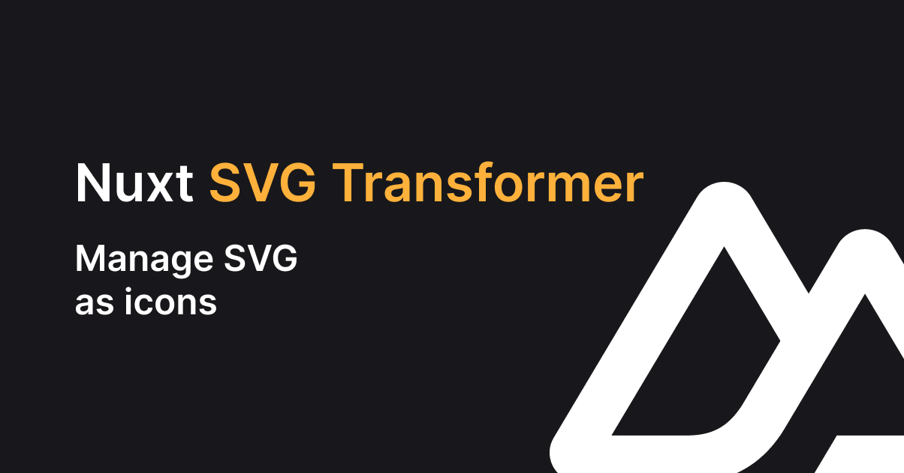

# nuxt-svg-transformer

[](./docs/public/cover.jpg)

[](https://www.npmjs.com/package/nuxt-svg-transformer)
[](https://nuxt.com/)


A **Nuxt 3** module to manage SVG as icons.

- [▶️ &nbsp;Play online](https://stackblitz.com/edit/nuxt-starter-vvr4qn)

## Why

The main module of Nuxt 3 to manage icons is [nuxt-modules/icon](https://github.com/nuxt-modules/icon), with this module you will be able to use directly SVGs from different libraries without importing, you can also registering Vue components to have custom SVGs. If you want to use SVG from library [nuxt-modules/icon](https://github.com/nuxt-modules/icon) can be very interesting for you!

Module [gitFoxCode/nuxt-icons](https://github.com/gitFoxCode/nuxt-icons) have a similar behavior of `nuxt-svg-transformer` module, the main difference is that [gitFoxCode/nuxt-icons](https://github.com/gitFoxCode/nuxt-icons) directly imports SVGs. If you just want to import SVG, try this module!

With `nuxt-svg-transformer`, `svg` aren't directly load from original file but from cache files, `name` is typed to avoid errors, keep native SVG with `fill`/`width`/`height` and you have some options to manage your SVG. It's useful if you want to manage your SVG as icons, without using a library, and without using a custom loader.

## Installation

With `NPM`

```bash
npm install nuxt-svg-transformer -D
```

Or `yarn`

```bash
yarn add nuxt-svg-transformer -D
```

Or `pnpm`

```bash
pnpm add nuxt-svg-transformer -D
```

## Features

- 🔎 Vue component ready with `SvgIcon`
- 🔥 Hot reloading when SVG updated
- 🤙🏻 Reactivity option
- 🗂 Seperated index SVG files
- 📦 No import needed, SVG directly injected
- 🎨 Options to add or clear `style` and `class` global attributes
- 🦾 SVG typed, validate by `name` prop (`typescript` required)

## Demo

Available on [StackBlitz](https://stackblitz.com/edit/nuxt-starter-vvr4qn).

## Usage

```ts
import { defineNuxtConfig } from 'nuxt/config'

export default defineNuxtConfig({
  modules: [
    'nuxt-svg-transformer',
  ],
  svgTransformer: {
    // ...
  },
})
```

| **Option**      | **Type**                | **Default**       | **Description**                                                                                                                                      |
| --------------- | ----------------------- | ----------------- | ---------------------------------------------------------------------------------------------------------------------------------------------------- |
| `assetsDir`     | `string`                | `assets/icons`    | Path where original SVG stored.                                                                                                                      |
| `classDefault`  | `?string`               | `undefined`       | Add default classes to all SVGs.                                                                                                                     |
| `clearClass`    | `all`, `parent`, `none` | `none`            | Clear all classes from SVGs (can be just all, just parent or none).                                                                                  |
| `clearSize`     | `all`, `parent`, `none` | `none`            | Clear `width` and `height` attributes from SVGs (can be just all, just parent or none).                                                              |
| `clearStyle`    | `all`, `parent`, `none` | `none`            | Clear all native styles from SVGs (can be just all, just parent or none).                                                                            |
| `componentName` | `string`                | `SvgIcon`         | Name of component.                                                                                                                                   |
| `fallback`      | `string` or `false`     | `<svg ...></svg>` | Fallback SVG if error, can be set to `false` to have no render.                                                                                      |
| `inlineBlock`   | `boolean`               | `true`            | Add `display: inline-block` to component.                                                                                                            |
| `lazy`          | `boolean`               | `true`            | Global option to toggle lazy icons, if disabled, hot reloading can have some issues.                                                                 |
| `log`           | `boolean`               | `true`            | Log to alert if errors, can be override with prop.                                                                                                   |
| `reactive`      | `boolean`               | `false`           | Enable reactivity to allow `name` prop to be switched, can be override with prop.                                                                    |
| `sizeInherit`   | `boolean`               | `false`           | Global options to toggle size inheritance, inline `style` `height: inherit; width: inherit;`.                                                        |
| `styleDefault`  | `?string`               | `undefined`       | Add default styles to all SVGs.                                                                                                                      |
| `title`         | `boolean`               | `false`           | Global options to toggle title attribute on icon based on SVG filename. If you set `title` on any `SvgIcon` component, it will override this option. |

Put your SVG into `assets` path from config, default is `assets/icons`.

```bash
assets/
  icons/
    nest-dir/
      arrow.svg
    home.svg
    about.svg
    contact.svg
app.vue
```

In any Vue component, you can use `svg-icon` component with `name` prop. The component is `display:block` by default (so you can use `width` and `height` attributes).

```vue
<template>
  <div>
    <svg-icon name="home" /> <!-- inject home.svg -->
    <svg-icon name="abut" /> <!-- Type error! -->
    <svg-icon name="nest-dir/arrow" /> <!-- inject nest-dir/arrow.svg -->
  </div>
</template>
```

## `SvgIcon` Props

| **Prop**   | **Type**   | **Required** | **Default** | **Description**                                                                             |
| ---------- | ---------- | ------------ | ----------- | ------------------------------------------------------------------------------------------- |
| `name`     | `IconType` | `true`       | `undefined` | Name of SVG.                                                                                |
| `lazy`     | `boolean`  | `false`      | `config`    | Lazy loading of SVG, default from config.                                                   |
| `log`      | `boolean`  | `false`      | `config`    | Log to warn if errors, default from config.                                                 |
| `title`    | `string`   | `false`      | `config`    | Set `title` attribute, default `title` will be SVG name if `autoTitle` is enable in config. |
| `reactive` | `boolean`  | `false`      | `config`    | Allow reactivity `name` from `ref()`, default from config.                                  |

## More typescript in your app?

Try [nuxt-typed-link](https://github.com/kiwilan/nuxt-typed-link) to get typed link into your app.

## 💻 Development

- Clone repository
- Install dependencies using `pnpm i`
- Prepare using `pnpm dev:prepare`
- Try playground using `pnpm dev`

### Local module

Create a `tgz`.

```bash
rm -f ~/nuxt-svg-transformer-*.tgz && npm pack && mv nuxt-svg-transformer-*.tgz ~/
```

Add it to your Nuxt app.

```json
{
  "devDependencies": {
    "nuxt-svg-transformer": "file:~/nuxt-svg-transformer-0.0.41.tgz"
  }
}
```

## License

[MIT](./LICENSE)

[](https://github.com/kiwilan)
